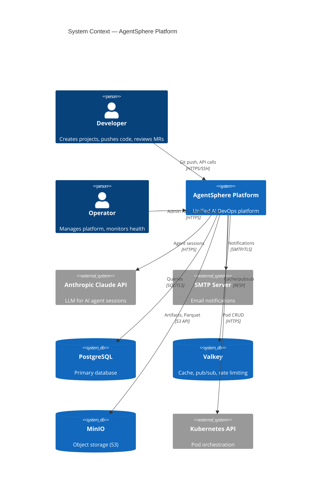
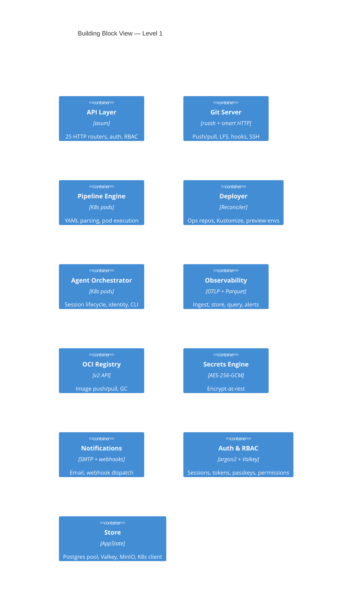

# Plan: arc42 Architecture Documentation

Generate comprehensive arc42 documentation for the AgentSphere platform with Mermaid.js diagrams.

---

## Tool Choice: Mermaid.js

Evaluated Structurizr (DSL), Mermaid.js, PlantUML, and D2.

| Criteria | **Mermaid.js** | **D2** | **Structurizr** | **PlantUML** |
|---|---|---|---|---|
| **GitHub native rendering** | Yes (fenced blocks) | No | No | No |
| **Markdown embedding** | Native | Needs plugin | External | Needs plugin |
| **CI/CD rendering** | `mermaid-cli` (npm) | `d2` (single binary) | `structurizr-cli` (Java) | Java dependency |
| **C4 model support** | Yes (via C4 plugin) | No native | Core feature | Yes (via stdlib) |
| **Automated extraction** | Easy — text-based DSL | Easy — clean syntax | Rigid DSL | Verbose XML-like |
| **Rust tooling ecosystem** | Best — text generation trivial | Good — clean syntax | Poor | Moderate |
| **Learning curve** | Low | Low | Medium | Medium |
| **Visual quality** | Good (Elk layout engine) | Excellent (TALA/dagre) | Good | Dated |

**Winner: Mermaid.js** — GitHub-native rendering eliminates "docs rot", trivial code generation from Rust, `mmdc` CLI for CI export.

---

## File Structure

```
docs/arc42/
├── 00-about.md                    # How to read/maintain this doc
├── 01-introduction-goals.md       # Requirements, quality goals, stakeholders
├── 02-constraints.md              # Technical, organizational, conventions
├── 03-context-scope.md            # System boundary (C4 L1 Context)
├── 04-solution-strategy.md        # Fundamental decisions
├── 05-building-blocks.md          # Static decomposition (C4 L2/L3)
├── 06-runtime-view.md             # Sequence diagrams for key flows
├── 07-deployment-view.md          # K8s topology, infra mapping
├── 08-crosscutting-concepts.md    # Auth, RBAC, observability, security, etc.
├── 09-architecture-decisions.md   # ADRs
├── 10-quality-requirements.md     # Quality tree + scenarios
├── 11-risks-technical-debt.md     # Known risks, gaps
├── 12-glossary.md                 # Domain + technical terms
└── diagrams/                      # Extracted/generated Mermaid sources
    ├── context.mmd
    ├── containers.mmd
    ├── components-agent.mmd
    ├── components-deployer.mmd
    ├── deployment-kind.mmd
    ├── deployment-prod.mmd
    ├── runtime-cicd-overview.mmd
    ├── runtime-mr-pipeline.mmd
    ├── runtime-merge-gitops.mmd
    ├── runtime-deploy-canary.mmd
    ├── runtime-auth.mmd
    ├── runtime-agent.mmd
    ├── runtime-observe.mmd
    ├── state-pipeline.mmd
    ├── state-deployment.mmd
    ├── two-repo-topology.mmd
    ├── step-types.mmd
    └── er-schema.mmd
```

---

## Section-by-Section Plan

### Section 1: Introduction & Goals

**Content to write:**
- **Business context**: "Replace 8+ off-the-shelf tools (Gitea, Woodpecker, Authelia, OpenObserve, Maddy, OpenBao) with a single unified AI DevOps platform"
- **Top 5 functional requirements**: Git hosting, CI/CD pipelines, deployment orchestration, AI agent sessions, observability
- **Top 5 quality goals** (ranked):
  1. Security — multi-tenant isolation, RBAC, encryption at rest
  2. Operability — single binary, minimal infra, self-healing
  3. Reliability — state machine enforcement, reconciliation loops
  4. Efficiency — single process, shared state, no IPC overhead
  5. Testability — 4-tier pyramid, compile-time query checking
- **Stakeholder table**: Platform operators, developers (tenants), AI agents, security auditors

**Source**: `CLAUDE.md`, `docs/architecture.md`, `README.md`
**Effort**: Manual (stable, rarely changes)

---

### Section 2: Constraints

**Content to write:**
- **Technical**: Rust (no unsafe), rustls (no openssl), sqlx compile-time checking, K8s-native, single crate
- **Organizational**: Solo/small-team development, kind for dev, no separate infra team
- **Conventions**: CLAUDE.md coding standards, `just` task runner, pre-commit hooks

**Source**: `CLAUDE.md`, `Cargo.toml` lints, `deny.toml`, `.pre-commit-config.yaml`
**Effort**: Low — extract from existing config files

---

### Section 3: Context & Scope

**Diagram to create** (C4 Context — L1):



**Source**: `src/config.rs` (all external connection configs), `src/store/mod.rs` (AppState fields)
**Automation potential**: HIGH — extract from `AppState` struct fields + config env vars

---

### Section 4: Solution Strategy

**Content to write (6 key decisions):**

| Decision | Motivation |
|---|---|
| Single Rust binary over microservices | Eliminate IPC overhead, simplify deployment, single image |
| Postgres as source of truth | Compile-time checked queries (sqlx), ACID transactions |
| Event-driven + reconciliation loops | Notify for immediate wake, polling for crash recovery |
| Per-project K8s namespaces | Tenant isolation, NetworkPolicy enforcement |
| Agents as first-class users | Uniform RBAC for humans and AI, delegation model |
| Embedded UI via rust-embed | Single artifact, no CORS issues, atomic deploys |

**Source**: `CLAUDE.md` architecture rules, `docs/architecture.md`
**Effort**: Manual — requires rationale narrative

---

### Section 5: Building Block View

**Level 1 — White-box of the Platform** (C4 Container diagram):



**Level 2 — Zoom into critical modules** (C4 Component diagrams for):
- **Agent** (most complex: 14 submodules, 6K LOC) — service, identity, claude_code/, claude_cli/, pubsub_bridge, create_app
- **Deployer** (8 submodules, 3K LOC) — reconciler, applier, renderer, ops_repo, preview, gateway
- **Pipeline** (4 submodules, 2K LOC) — definition, executor, trigger
- **API** (25 sub-routers, 8K LOC) — grouping by domain (identity, project, devops, observe, admin)

**Source**: `src/*/mod.rs` re-exports, `src/api/mod.rs` router merges
**Automation potential**: HIGH — parse `mod.rs` files for `pub mod` and `pub use` declarations

---

### Section 6: Runtime View

8 scenarios covering all major flows:

| # | Scenario | Source | Diagram Type | Complexity |
|---|---|---|---|---|
| **R1** | **Full CI/CD Lifecycle** | `plans/cicd-process-spec-v2.md` — Target Flow | `flowchart` (overview) | Epic |
| **R2** | **MR Pipeline: Trigger → Build → Test** | Spec Phase 1-2 | `sequenceDiagram` | High |
| **R3** | **Auto-Merge → Main Pipeline → GitOps Sync** | Spec Phase 3-5 | `sequenceDiagram` | High |
| **R4** | **Deploy Pipeline: OpsRepo → Reconciler → Canary → Promote** | Spec Phase 7-8 | `sequenceDiagram` | High |
| **R5** | Auth Flow (login → session → RBAC check) | `src/auth/`, `src/rbac/` | `sequenceDiagram` | Medium |
| **R6** | Agent Session Lifecycle | `src/agent/service.rs` | `sequenceDiagram` | Medium |
| **R7** | Observability Pipeline (OTLP → Parquet → Query) | `src/observe/` | `flowchart` | Medium |
| **R8** | Pipeline & Deployment State Machines | `can_transition_to()` | `stateDiagram-v2` | Low |

#### R1: Full CI/CD Lifecycle (Master Overview)

The "30,000-foot view" — a single flowchart showing the entire lifecycle from the spec's target flow:

```
Code Push → MR Pipeline → Auto-Merge → Main Pipeline → GitOps Sync
  → Staging Deploy → Canary Progression → Manual QA → Promote
  → Production Deploy → Feature Flags Live
```

**Mermaid type**: `flowchart LR` with subgraphs for each phase
**Content mapping from spec**:

| Subgraph | Spec Phase | Key steps |
|---|---|---|
| Code Repo | Phase 1 | Feature branch, MR creation, `.platform.yaml` |
| MR Pipeline | Phase 2 | 4x `imagebuild` + `deploy_test` (e2e) |
| Merge Gate | Phase 3-4 | Auto-merge → `on_push(main)` trigger |
| Main Pipeline | Phase 2+5+6 | 3x `imagebuild` + `gitops_sync` + `deploy_watch` |
| Ops Repo | Phase 5 | Copy deploy/, values, platform.yaml to staging branch |
| Staging | Phase 7-8 | Reconciler → namespace → secrets → render → apply → canary |
| Production | Phase 7-8 | Manual promote → same flow on prod |
| Runtime | Phase 9 | Feature flag evaluation via injected tokens |

#### R2: MR Pipeline (Trigger → Build → Test)

**Sequence diagram** covering spec Phase 1-2:

```
Developer → Git (push to feature branch)
Git → PostReceiveHook → EventBus
EventBus → pipeline::trigger::on_mr()
on_mr → Read .platform.yaml at SHA
on_mr → Parse + validate definition
on_mr → Match trigger (mr.actions: [opened])
on_mr → INSERT pipelines + pipeline_steps
on_mr → state.pipeline_notify.notify_one()
Executor → wake, poll pending steps
Executor → For each step (DAG order):
  Executor → Create pipeline namespace
  Executor → imagebuild: generate kaniko command
  Executor → Resolve secrets → --build-arg
  Executor → Spawn K8s Pod (init: git clone, main: kaniko)
  Executor → Poll pod status (3s, 900s timeout)
  Executor → Capture logs → MinIO
  Executor → Update step status
Executor → deploy_test (e2e):
  Executor → Create test namespace
  Executor → Inject secrets (scope: test/all) + OTEL tokens
  Executor → Apply testinfra manifests
  Executor → Wait for readiness
  Executor → Spawn test pod
  Executor → Cleanup test namespace
Executor → finalize_pipeline(success)
  Executor → try_auto_merge()
```

**Participants**: Developer, Git Server, EventBus, Pipeline Trigger, Executor, K8s API, Registry, MinIO

#### R3: Auto-Merge → Main Pipeline → GitOps Sync

**Sequence diagram** covering spec Phase 3-5:

```
finalize_pipeline → try_auto_merge()
try_auto_merge → check auto_merge=true
try_auto_merge → do_merge() (git worktree --no-ff)
do_merge → on_push(main, merge_sha)  [explicit trigger]
on_push → parse .platform.yaml
on_push → INSERT pipeline (trigger=push)
on_push → notify_one()
Executor → build-app, build-canary, build-dev (parallel)
Executor → sync-ops-repo (gitops_sync, depends: builds):
  Executor → Look up ops repo
  Executor → Copy deploy/ + .platform.yaml
  Executor → Merge variables_{env}.yaml → values/{env}.yaml
  Executor → Determine target branch (project.include_staging)
  Executor → Build values JSON (image_ref, canary_image_ref, user vars)
  Executor → Commit to ops repo staging branch
  Executor → Publish OpsRepoUpdated event
  Executor → Register feature flags + prune old
Executor → watch-deploy (deploy_watch, depends: sync-ops-repo):
  Executor → Find latest deploy_releases for staging
  Executor → Poll phase every 5s until terminal
  Executor → Write result to step log
```

**Participants**: Executor, Git Server, Ops Repo, EventBus, Pipeline DB, K8s API

#### R4: Deploy Pipeline (Reconciler + Canary Progression)

**Sequence diagram** covering spec Phase 7-8:

```
EventBus → handle_ops_repo_updated()
handler → Read .platform.yaml from ops repo
handler → Extract strategy + rollout_config
handler → Upsert deploy_targets
handler → INSERT deploy_releases (phase=pending)
handler → state.deploy_notify.notify_one()

Reconciler → handle_pending(release):
  Reconciler → Create namespace {slug}-{env}
  Reconciler → inject_project_secrets():
    Query secrets (scope: staging/all)
    Auto-inject OTEL tokens (create API token)
    Auto-inject PLATFORM_API_TOKEN
    Create K8s Secret
  Reconciler → ensure_registry_pull_secret()
  Reconciler → render_manifests() (minijinja with values/{env}.yaml)
  Reconciler → apply_manifests() (server-side apply)
  Reconciler → Strategy=canary: set initial traffic weight → progressing

Analysis Loop (15s):
  Check rollback triggers
  Evaluate progress gates (error_rate < 0.05)
  Verdict: pass → advance (10% → 25% → 50% → 100%)
  Verdict: fail → rolling_back

Reconciler → handle_promoting():
  Route 100% to stable
  Re-render manifests
  phase=completed, health=healthy

Manual promote (staging → production):
  API → POST /promote-staging
  API → Merge ops repo staging → main
  API → Publish OpsRepoUpdated(production)
  → Same reconciler flow for production
```

**Participants**: EventBus, Reconciler, Analysis Loop, K8s API, Ops Repo, Secrets Engine, API

#### R5: Auth Flow

Login → session → AuthUser extractor → RBAC check
**Source**: `src/auth/middleware.rs`, `src/rbac/resolver.rs`

#### R6: Agent Session Lifecycle

Create → spawn K8s pod → ephemeral identity → CLI subprocess → NDJSON → reaper
**Source**: `src/agent/service.rs`, `src/agent/identity.rs`

#### R7: Observability Pipeline

OTLP ingest → channel → flush → Parquet → MinIO → query → alert eval
**Source**: `src/observe/ingest.rs`, `src/observe/parquet.rs`

#### R8: State Machines

`PipelineStatus` and `DeploymentPhase` `stateDiagram-v2` — auto-extractable from `can_transition_to()` match arms.

#### Additional Diagrams

**Two-Repo Topology** (from spec lines 9-28):
```
Code Repo                          Ops Repo
├── .platform.yaml          ──→    ├── platform.yaml
├── deploy/                 ──→    ├── deploy/  (copied)
│   ├── variables_staging.yaml ─→  ├── values/staging.yaml (merged)
│   └── variables_prod.yaml   ─→  │   └── production.yaml (merged)
├── testinfra/                     ├── staging branch
└── Dockerfile                     └── main branch (production)
```

**Step Type Reference**:

| Step Type | Executor Behavior | Spawns Pod? |
|---|---|---|
| `imagebuild` | Generate kaniko command, inject secrets as `--build-arg`, push to registry | Yes (kaniko) |
| `deploy_test` | Create test namespace, apply testinfra, spawn test pod, cleanup | Yes (test runner) |
| `gitops_sync` | Copy files to ops repo, merge variables, commit, publish event | No (in-process) |
| `deploy_watch` | Poll deploy_releases table until terminal phase | No (in-process) |
| (regular) | Run arbitrary container with setup commands | Yes (user image) |

---

### Section 7: Deployment View

**Diagrams to create:**

1. **Kind Dev Cluster** topology:
   - Single node, port-mapped (5432, 6379, 8080, 9000)
   - Namespaces: `platform`, `platform-test-*`, `{slug}-dev`
   - Pods: platform, postgres, valkey, minio

2. **Production Target** (aspirational):
   - Multi-node, ingress controller, cert-manager
   - Persistent volumes for Postgres, MinIO
   - Platform Deployment + per-project namespaces

3. **Container image build** pipeline:
   - Multi-stage Dockerfile → distroless final stage
   - `just docker` → `just deploy-local` → kind load

**Source**: `deploy/`, `docker/Dockerfile`, `hack/cluster-up.sh`, `Justfile`
**Automation potential**: HIGH — parse Kustomize YAML, Dockerfile stages

---

### Section 8: Crosscutting Concepts

| Concept | Content Source |
|---|---|
| **Authentication** | `src/auth/` — argon2, timing-safe, passkeys, CLI device-code |
| **Authorization (RBAC)** | `src/rbac/` — roles, permissions, delegation, workspace-derived |
| **Input Validation** | `src/validation.rs` — field limits table, SSRF protection |
| **Error Handling** | `src/error.rs` — ApiError enum, per-module thiserror |
| **Observability** | `src/observe/` — OTLP, Parquet, self-observe, correlation |
| **Security** | Rate limiting, CORS, body limits, security headers, webhook HMAC |
| **State Machines** | `PipelineStatus`, `DeploymentPhase`, `can_transition_to()` |
| **Domain Model** | ER diagram from migrations (Mermaid `erDiagram`) |
| **Testing Strategy** | 4-tier pyramid, mock CLI, per-test DB isolation |
| **Configuration** | 60+ env vars, `src/config.rs`, dev mode vs production |

**Source**: Already well-documented in `CLAUDE.md` — consolidate and cross-reference

---

### Section 9: Architecture Decisions

14 ADRs to document:

| # | Decision | Status |
|---|---|---|
| ADR-001 | Single binary over microservices | Accepted |
| ADR-002 | Rust with `forbid(unsafe_code)` | Accepted |
| ADR-003 | rustls, ban openssl | Accepted |
| ADR-004 | sqlx compile-time queries over ORM | Accepted |
| ADR-005 | Valkey (Redis fork) over Redis | Accepted |
| ADR-006 | MinIO (S3 API) for object storage | Accepted |
| ADR-007 | Embedded SPA (rust-embed) over separate frontend | Accepted |
| ADR-008 | Preact over React for UI | Accepted |
| ADR-009 | Per-project K8s namespaces for isolation | Accepted |
| ADR-010 | Agents as first-class users with delegation | Accepted |
| ADR-011 | Event-driven + reconciliation (not pure event sourcing) | Accepted |
| ADR-012 | OTLP + Parquet over external observability stack | Accepted |
| ADR-013 | Built-in OCI registry over external | Accepted |
| ADR-014 | Kind for dev clusters (not OrbStack/minikube) | Accepted |

**Format**: ADR with Context → Decision → Consequences

---

### Section 10: Quality Requirements

**Quality tree** (using arc42 Q42 model):

```
Quality Goals
├── Secure (#secure)
│   ├── QS-1: Timing-safe auth (no user enumeration)
│   ├── QS-2: RBAC resolution < 5ms (cached)
│   ├── QS-3: Secrets encrypted at rest (AES-256-GCM)
│   └── QS-4: SSRF blocked on all outbound user-supplied URLs
├── Operable (#operable)
│   ├── QO-1: Single binary deploys in < 30s
│   ├── QO-2: Health endpoint reports all 6 subsystems
│   ├── QO-3: Background tasks self-heal (reconciliation)
│   └── QO-4: 60+ config knobs via env vars (12-factor)
├── Reliable (#reliable)
│   ├── QR-1: State machine transitions compile-time enforced
│   ├── QR-2: Pipeline recovery on pod restart
│   └── QR-3: Reconciler converges within 10s of desired state change
├── Efficient (#efficient)
│   ├── QE-1: Single-process, no IPC overhead
│   ├── QE-2: Connection pooling (Postgres, Valkey)
│   └── QE-3: Permission cache reduces DB load by ~95%
└── Testable (#testable)
    ├── QT-1: 100% diff coverage enforcement (unit+integration)
    ├── QT-2: Compile-time SQL validation
    └── QT-3: 4-tier testing pyramid with real infra
```

---

### Section 11: Risks & Technical Debt

| ID | Type | Item | Impact |
|---|---|---|---|
| R-1 | Risk | Single binary = single point of failure | High — mitigated by K8s restart policy |
| R-2 | Risk | No HA mode (single replica) | High — no horizontal scaling yet |
| R-3 | Debt | Force-push rejection not implemented (Plan 03 gap) | Low |
| R-4 | Debt | Some missing unit tests in secrets/pipeline definition | Medium |
| R-5 | Debt | Secret request flow gaps (SSE, ProgressKind, scope) | Medium |
| R-6 | Risk | Kind dev cluster != production topology | Medium — no prod validation yet |
| R-7 | Debt | E2E tests still include some single-endpoint tests | Low |

---

### Section 12: Glossary

~30 terms: Platform, Project, Workspace, Pipeline, Step, Deployment, Release, Agent, Session, Delegation, Permission, Role, Ops Repo, Preview Environment, Reconciler, Applier, OTLP, Parquet, Master Key, Boundary (token scope), AuthUser, AppState, EventBus, Slug, MR, Webhook, OCI, Registry, Artifact, Canary

---

## Diagram Automation Strategy

| Diagram | Type | Generation Method |
|---|---|---|
| C4 Context (L1) | `C4Context` | Semi-auto: extract `AppState` fields → external systems |
| C4 Container (L2) | `C4Container` | Auto: parse `src/*/mod.rs` for module names + doc comments |
| C4 Component (L3) | `C4Component` | Auto: parse `pub mod` + `pub fn` in selected modules |
| State machines | `stateDiagram-v2` | Auto: extract `can_transition_to()` match arms |
| ER diagram | `erDiagram` | Auto: parse `CREATE TABLE` from `migrations/*.up.sql` |
| API routes | `flowchart` | Auto: parse `.route()` calls in `src/api/mod.rs` |
| Runtime sequences | `sequenceDiagram` | Manual (flow logic, not parseable) |
| Deployment topology | `C4Deployment` | Semi-auto: parse Kustomize YAML |

**Tooling**: `just arc42-diagrams` task that generates Mermaid `.mmd` files from source.

---

## Execution Phases

| Phase | Sections | Effort | Status |
|---|---|---|---|
| **1. Skeleton** | All 13 files with headers | 1 session | **DONE** |
| **2. Auto-diagrams** | 3, 5, 7, R8, ER + 17 .mmd files | 1 session | **DONE** |
| **3. Core narrative** | 1, 2, 4, 12 | 1 session | **DONE** |
| **4. CI/CD runtime** | R1-R4 + two-repo + step-types | 1 session | **DONE** |
| **5. Other runtime + concepts** | R5-R7, Section 8 | 1 session | **DONE** |
| **6. Decisions & quality** | 9, 10 | 1 session | **DONE** |
| **7. Risks & polish** | 11, final review | 1 session | **DONE** |
| **Total** | 13 docs + 17 diagrams | **1 session** | **COMPLETE** |
